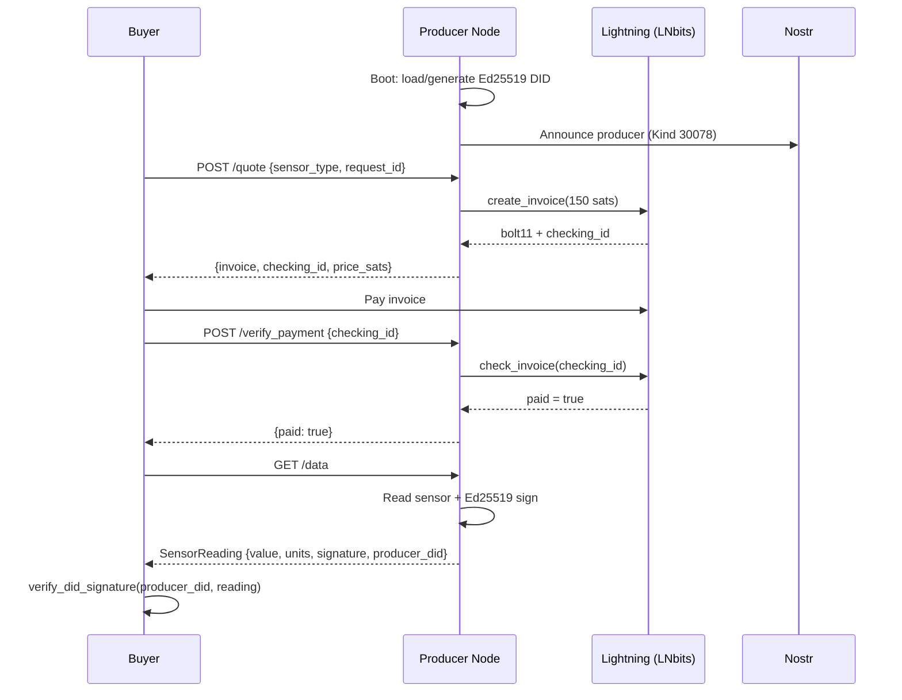

<div align="center">
  
  <h1>Sensor Data Exchange Node (SDEN)</h1>
  <p><strong>Sell cryptographically signed sensor data over Bitcoin Lightning. No token. No new blockchain. No middleman.</strong></p>
  <p>
    <a href="https://github.com/intrinsicinvestment91/sensor-data-exchange-node/actions/workflows/ci.yml">
      
    </a>
    <a href="LICENSE">
      
    </a>
    <a href="docs/ris/SDEN_RIS_v1.md">
      
    </a>
    <a href="https://www.python.org/">
      
    </a>
  </p>
</div>

---

A SDEN producer node collects IoT sensor readings, signs each one with an Ed25519 DID, issues a Lightning invoice, and delivers verified data after payment — no platform, no custodian, no new token required.

## Why SDEN?

Every other sensor data marketplace requires a new token, a new blockchain, or a centralized platform:

| | SDEN | Ocean Protocol | Streamr | DIMO | peaq |
|---|:---:|:---:|:---:|:---:|:---:|
| **New token required** | **No** | OCEAN | DATA | $DIMO | DOT |
| **New blockchain** | **No** | EVM | EVM | EVM | Polkadot |
| **Runs on Raspberry Pi** | ✓ | ✗ | ✗ | ✗ | ✗ |
| **Ed25519 signed readings** | ✓ | ✗ | ✗ | ✗ | ✗ |
| **W3C WoT compatible** | ✓ | ✗ | ✗ | ✗ | ✗ |
| **Non-custodial** | ✓ | ✗ | ✗ | ✗ | ✗ |

SDEN runs on existing Bitcoin Lightning infrastructure. Producers and buyers each control their own wallets. See [docs/comparisons.md](docs/comparisons.md) for a full technical breakdown.

---

## How it works



**State machine:** `IDLE → REQUEST_RECEIVED → VALIDATED → PRICED → INVOICED → PAID → DELIVERED`

All failures are terminal. No retries. No partial payments.

---

## Quickstart

Requires a [LNbits](https://lnbits.com) wallet for real Lightning payments. Mock sensor mode works out of the box — no hardware needed.

```bash
git clone https://github.com/intrinsicinvestment91/sensor-data-exchange-node
cd sensor-data-exchange-node
cp .env.example .env
# Edit .env: set LNBITS_URL and LNBITS_API_KEY
docker-compose up
```

Producer node is now running at `http://localhost:8080`.

### Buy a reading with curl

```bash
REQUEST_ID=$(python3 -c "import uuid; print(uuid.uuid4())")
TS=$(date -u +%Y-%m-%dT%H:%M:%SZ)

# 1. Get a Lightning invoice
curl -s -X POST http://localhost:8080/quote \
  -H "Content-Type: application/json" \
  -d "{\"request_id\":\"$REQUEST_ID\",\"sensor_type\":\"temperature\",\"quantity\":1,\"timestamp_utc\":\"$TS\",\"signature\":\"open\"}" \
  | jq .
# → { "invoice": "lnbc150n1...", "checking_id": "...", "price_sats": 150 }

# 2. Pay the invoice from your Lightning wallet (out of band)

# 3. Confirm payment and retrieve signed data
curl -s -X POST http://localhost:8080/verify_payment \
  -H "Content-Type: application/json" \
  -d "{\"request_id\":\"$REQUEST_ID\",\"checking_id\":\"<checking_id>\"}"

curl -s http://localhost:8080/data | jq .
```

Example `GET /data` response:

```json
{
  "producer_did": "did:key:z6MkuV...",
  "sensor_type": "temperature",
  "timestamp_utc": "2026-04-22T00:00:00Z",
  "value": 22.4,
  "units": "celsius",
  "quality_score": 0.98,
  "signature": "<Ed25519 base64>"
}
```

> **Python buyer SDK (`sden-client`) and `sden-buy` CLI available in `sden-client/`.**

---

## API

| Endpoint | Method | Description |
|---|---|---|
| `/quote` | POST | Request price and receive Lightning invoice |
| `/verify_payment` | POST | Confirm payment settlement |
| `/data` | GET | Retrieve signed sensor reading |
| `/td` | GET | W3C WoT 1.1 Thing Description |
| `/health` | GET | Liveness probe |
| `/info` | GET | Producer DID, sensor type, price |

Full schemas and error codes: [`docs/ris/SDEN_RIS_v1.md`](docs/ris/SDEN_RIS_v1.md)

---

## Mock sensor mode

Set `USE_MOCK_SENSOR=true` (the default) to generate realistic, randomized readings with no hardware. Supported sensor types: `temperature`, `humidity`, `pressure`, `co2`.

---

## Architecture

```
sden/
  main.py          # entry point — reads env, boots producer
  sensor_agent.py  # FastAPI app, all endpoints, state machine enforcement
  did_identity.py  # Ed25519 keygen, did:key encoding, sign/verify, key persistence
  audit_db.py      # SQLite append-only signed audit log + replay-attack deduplication
  state_machine.py # IDLE → DELIVERED transition guard
  models.py        # Pydantic schemas for all RIS v1.0 request/response bodies
  sensor_reader.py # MockSensorReader + DHT22Reader hardware abstraction
  pricing.py       # Pluggable pricing engine (flat rate by default via PRICE_SATS)

sden-client/       # Buyer SDK — pip install sden-client (PyPI, coming soon)
  sden_client/
    buyer.py       # SDENBuyer — full buy cycle in one call
    wallet.py      # SDENWallet — LNbits payment wrapper
    models.py      # SensorReading with .verify()
    cli.py         # sden-buy CLI
```

---

## Identity persistence

On first boot, SDEN generates an Ed25519 key and writes it to `DID_KEY_PATH` (default: `identity.pem`). The producer's DID is stable across restarts. The docker-compose setup stores both the key and audit log in a named volume (`sden_data`).

To inject a key via environment variable (recommended for containers):

```bash
export DID_PRIVATE_KEY_PEM="$(cat identity.pem)"
docker-compose up
```

---

## Running tests

```bash
pip install -r requirements-dev.txt
make test        # lint (ruff) + type-check (mypy) + full test suite (pytest)
make benchmark   # assert RIS v1.0 timing targets
```

---

## Documentation

| Document | Description |
|---|---|
| [`docs/ris/SDEN_RIS_v1.md`](docs/ris/SDEN_RIS_v1.md) | Protocol spec (frozen at v1.0) — authoritative implementation reference |
| [`docs/spec/`](docs/spec/) | Core protocol definitions: identity, verification, settlement, governance |
| [`docs/PLAN.md`](docs/PLAN.md) | Development roadmap and phase tracking |
| [`docs/why-sden.md`](docs/why-sden.md) | The case for Bitcoin-native IoT data markets |
| [`docs/comparisons.md`](docs/comparisons.md) | Technical comparison with Ocean, Streamr, DIMO, peaq |

---

## Contributing

Issues and pull requests welcome. See [CONTRIBUTING.md](CONTRIBUTING.md) for development setup and contribution guidelines. For protocol changes, see [docs/CONTRIBUTING.md](docs/CONTRIBUTING.md).

Bugs and features: [GitHub Issues](https://github.com/intrinsicinvestment91/sensor-data-exchange-node/issues)

---

## License

[Apache 2.0](LICENSE)
