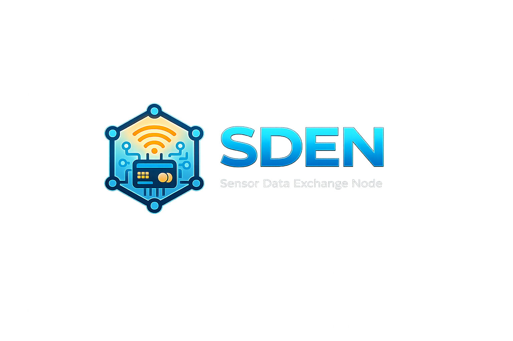
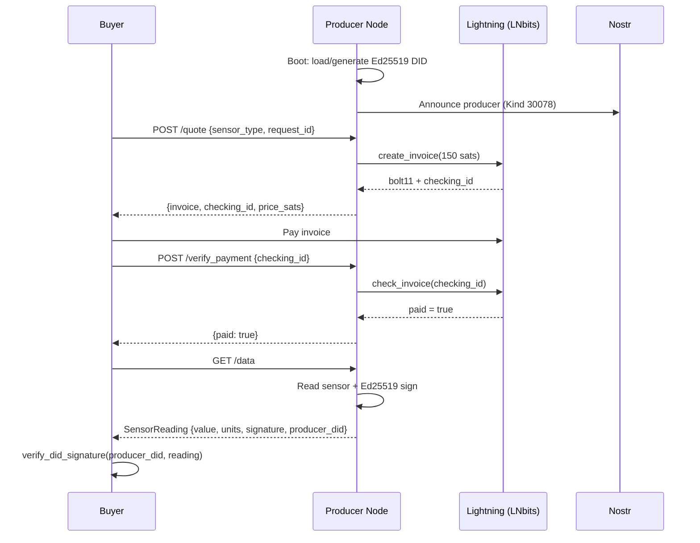
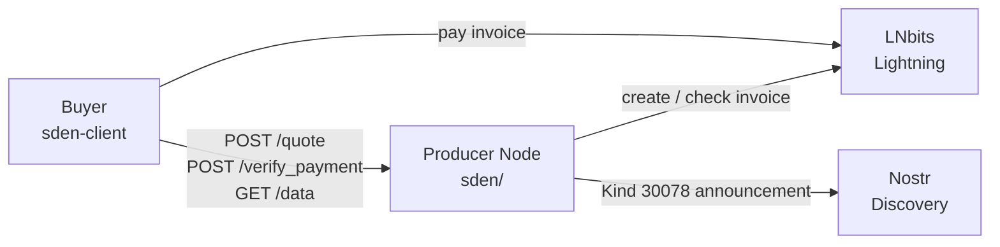

<div align="center">
  
  <h1>Sensor Data Exchange Node</h1>
  <p><strong>Buy and sell cryptographically verified sensor data over Bitcoin Lightning.<br/>No token. No new blockchain. No middleman.</strong></p>
  <p>
    <a href="https://github.com/intrinsicinvestment91/sensor-data-exchange-node/actions/workflows/ci.yml">
      
    </a>
    <a href="LICENSE">
      
    </a>
    <a href="docs/ris/SDEN_RIS_v1.md">
      
    </a>
    
    
    
  </p>
</div>

---

A SDEN producer node reads a sensor, signs each measurement with an Ed25519 DID, and sells it via a Lightning invoice — all without any intermediary platform or token. Any buyer with a Lightning wallet can purchase a verified reading in one HTTP round-trip.

## Buy a reading in 3 lines

```python
from sden_client import SDENBuyer, SDENWallet

wallet = SDENWallet(lnbits_url="https://...", api_key="<admin-key>")
with SDENBuyer("https://producer.example.com", wallet=wallet) as buyer:
    reading = buyer.buy(sensor_type="temperature")

assert reading.verify()          # Ed25519 signature check
print(reading.value, reading.units)  # 22.4 celsius
```

Or from the command line:

```
$ sden-buy --url http://localhost:8080 --type temperature
Requesting temperature reading from http://localhost:8080 …
Paid 150 sats. Temperature: 22.4 celsius (quality: 0.98) [✓ signature verified]
```

---

## Why SDEN?

Every existing sensor data marketplace requires a new token, a new chain, or a centralized platform:

|  | SDEN | Ocean Protocol | Streamr | DIMO | peaq |
|---|:---:|:---:|:---:|:---:|:---:|
| **New token required** | **No** | OCEAN | DATA | $DIMO | DOT |
| **New blockchain** | **No** | EVM | EVM | EVM | Polkadot |
| **Runs on Raspberry Pi** | ✓ | ✗ | ✗ | ✗ | ✗ |
| **Ed25519 signed readings** | ✓ | ✗ | ✗ | ✗ | ✗ |
| **W3C WoT compatible** | ✓ | ✗ | ✗ | ✗ | ✗ |
| **Non-custodial** | ✓ | ✗ | ✗ | ✗ | ✗ |

SDEN runs on existing Bitcoin Lightning infrastructure. Both producer and buyer control their own wallets. See [docs/comparisons.md](docs/comparisons.md) for a full technical breakdown.

---

## How it works



**State machine:** `IDLE → REQUEST_RECEIVED → VALIDATED → PRICED → INVOICED → PAID → DELIVERED`

All failures are terminal. No retries. No partial payments.

---

## Quickstart

### Run a producer node

Requires a [LNbits](https://lnbits.com) wallet. Mock sensor mode works out of the box — no hardware needed.

```bash
git clone https://github.com/intrinsicinvestment91/sensor-data-exchange-node
cd sensor-data-exchange-node
cp .env.example .env          # add LNBITS_URL and LNBITS_API_KEY
docker-compose up
```

The producer is now running at `http://localhost:8080`. Visit `/info` to see its DID, sensor type, and price.

### Buy a reading

**Python SDK** (install from source until PyPI release):

```bash
pip install -e ./sden-client
```

```python
from sden_client import SDENBuyer, SDENWallet

wallet = SDENWallet(lnbits_url="https://...", api_key="<admin-key>")
with SDENBuyer("http://localhost:8080", wallet=wallet) as buyer:
    reading = buyer.buy(sensor_type="temperature")

print(f"Paid {buyer.last_price_sats} sats.")
print(f"{reading.sensor_type}: {reading.value} {reading.units}")
print(f"Signature valid: {reading.verify()}")
```

**CLI:**

```bash
LNBITS_URL=https://... LNBITS_API_KEY=... sden-buy \
  --url http://localhost:8080 --type temperature
```

**Raw API with curl:**

```bash
REQUEST_ID=$(python3 -c "import uuid; print(uuid.uuid4())")
TS=$(date -u +%Y-%m-%dT%H:%M:%SZ)

# 1. Request an invoice
curl -sX POST http://localhost:8080/quote \
  -H "Content-Type: application/json" \
  -d "{\"request_id\":\"$REQUEST_ID\",\"sensor_type\":\"temperature\",\"quantity\":1,\"timestamp_utc\":\"$TS\",\"signature\":\"open\"}" | jq .

# 2. Pay the invoice from your Lightning wallet (out of band)

# 3. Confirm and retrieve signed data
curl -sX POST http://localhost:8080/verify_payment \
  -H "Content-Type: application/json" \
  -d "{\"request_id\":\"$REQUEST_ID\",\"checking_id\":\"<checking_id>\"}"

curl -s http://localhost:8080/data | jq .
```

Example `/data` response:

```json
{
  "producer_did": "did:key:z6MkuV...",
  "sensor_type": "temperature",
  "timestamp_utc": "2026-04-25T00:00:00Z",
  "value": 22.4,
  "units": "celsius",
  "quality_score": 0.98,
  "signature": "<Ed25519 base64>"
}
```

---

## Configuration

All settings are read from environment variables (copy `.env.example` to `.env`):

| Variable | Default | Description |
|---|---|---|
| `LNBITS_URL` | — | LNbits instance URL (required) |
| `LNBITS_API_KEY` | — | LNbits invoice API key (required) |
| `SENSOR_TYPE` | `temperature` | Active sensor type (`temperature`, `humidity`, `pressure`, `co2`) |
| `PRICE_SATS` | `150` | Price per reading in satoshis |
| `USE_MOCK_SENSOR` | `true` | Use randomized mock data — no hardware needed |
| `SDEN_HOST` | `0.0.0.0` | Bind address |
| `SDEN_PORT` | `8080` | Bind port |
| `INVOICE_EXPIRY_SECS` | `3600` | Invoice TTL before the session is terminated |
| `DID_KEY_PATH` | `identity.pem` | Path to Ed25519 private key (generated on first boot) |
| `DID_PRIVATE_KEY_PEM` | — | Full PEM string — preferred for containers and secrets managers |
| `AUDIT_DB_PATH` | `audit.db` | SQLite path for the signed audit log |

**Identity persistence:** On first boot, SDEN generates an Ed25519 keypair and writes it to `DID_KEY_PATH`. The DID is stable across restarts. The `docker-compose` setup stores both the key and audit log in a named volume (`sden_data`).

To inject a key at deploy time:

```bash
export DID_PRIVATE_KEY_PEM="$(cat identity.pem)"
docker-compose up
```

---

## API Reference

| Endpoint | Method | Description |
|---|---|---|
| `/quote` | POST | Validate request, issue Lightning invoice |
| `/verify_payment` | POST | Confirm payment, unlock data delivery |
| `/data` | GET | Return Ed25519-signed sensor reading |
| `/td` | GET | W3C WoT 1.1 Thing Description |
| `/health` | GET | Liveness probe |
| `/info` | GET | Producer DID, sensor type, current price |

Full request/response schemas and all error codes (100–105): [`docs/ris/SDEN_RIS_v1.md`](docs/ris/SDEN_RIS_v1.md)

---

## Architecture



The producer is a single `SensorAgent` class wired to a FastAPI app. On each `/quote` call it advances through a single-session state machine; the session resets after `DELIVERED` or `TERMINATED`. There is no database for in-flight state — everything is in memory, durably logged to an append-only SQLite audit table where every row carries an Ed25519 signature.

| Component | Role |
|---|---|
| `SensorAgent` | Owns the state machine, wallet, DID, and audit log — no base-class inheritance |
| `DIDIdentity` | Ed25519 keygen, `did:key:z6Mk…` encoding, sign/verify |
| `StateMachine` | Enforces `IDLE → DELIVERED` transitions; raises HTTP 409 on violations |
| `AuditDB` | Append-only SQLite log; every row is Ed25519-signed; replay deduplication via `seen_request_ids` |
| `AgentWallet` | Thin wrapper around LNbits REST API — the only runtime dependency on BitAgent |
| `SensorReader` | Hardware abstraction; `MockSensorReader` for dev/CI, `DHT22Reader` for hardware |
| `PricingEngine` | Pluggable ABC; default is `FlatPricingEngine` driven by `PRICE_SATS` |

---

## Performance

Targets from RIS v1.0, specified for minimum hardware (2-core ARMv8, 2 GB RAM). The CI benchmark (`make benchmark`) asserts the two marked targets against a mock wallet; the per-operation LNbits targets apply to production deployments and are not asserted here.

| Operation | Target | CI enforced |
|---|---|:---:|
| Quote response | < 500 ms | ✓ |
| Invoice generation (LNbits round-trip) | < 100 ms | |
| Invoice verification (LNbits check) | < 1 s | |
| Data retrieval + Ed25519 signing | < 2 s | |
| **Total end-to-end** | **< 3.5 s** | ✓ |

---

## Roadmap

| Phase | Goal | Status |
|---|---|---|
| 0 — Repository Presence | Repo docs, CI, issue templates | ✅ Complete |
| 1 — Core Reference Implementation | `docker-compose up` delivers a running node | ✅ Complete |
| 2 — Protocol Hardening | Full RIS compliance, security tests, W3C WoT endpoint | ✅ Complete |
| 3 — Developer Experience | Buyer SDK, CLI, benchmarks | ✅ Complete |
| 4 — Positioning & Community | README polish, PyPI publication, community onboarding | 🔄 In progress |

`sden-client` is **not yet published to PyPI** — install it from source as shown above.

The full roadmap with task checklists is in [`docs/PLAN.md`](docs/PLAN.md).

---

## Development

```bash
pip install -r requirements-dev.txt

make test        # lint (ruff) + type-check (mypy) + full test suite (pytest)
make benchmark   # assert RIS v1.0 timing targets

pytest tests/test_integration.py::test_full_buy_cycle -v   # single test
```

Tests patch `AgentWallet` and skip Nostr — no LNbits instance needed.

**Validation boundary:** validation currently uses a mock wallet and mock sensor; no end-to-end run against a live wallet and physical sensor is evidenced.

---

## Documentation

| Document | Description |
|---|---|
| [`docs/ris/SDEN_RIS_v1.md`](docs/ris/SDEN_RIS_v1.md) | Protocol spec (frozen at v1.0) — authoritative implementation reference |
| [`docs/spec/`](docs/spec/) | Core protocol definitions: identity, verification, settlement, governance |
| [`docs/PLAN.md`](docs/PLAN.md) | Development roadmap and phase tracking |
| [`docs/why-sden.md`](docs/why-sden.md) | The case for Bitcoin-native IoT data markets |
| [`docs/comparisons.md`](docs/comparisons.md) | Technical comparison with Ocean Protocol, Streamr, DIMO, peaq |

---

## Contributing

Issues and pull requests welcome. See [CONTRIBUTING.md](CONTRIBUTING.md) for setup and contribution guidelines. Protocol change proposals belong in [docs/CONTRIBUTING.md](docs/CONTRIBUTING.md).

**[Open an issue →](https://github.com/intrinsicinvestment91/sensor-data-exchange-node/issues)**

---

## Support

SDEN is an open protocol. If you find it useful, consider supporting development through [OpenSats](https://opensats.org) or [HRF](https://hrf.org/programs/bitcoin-development-fund/) grant nominations.

---

## License

[Apache 2.0](LICENSE)

Two vendored files under `bitagent/` are MIT-licensed and are not covered by Apache 2.0 — see [THIRD_PARTY_NOTICES.md](THIRD_PARTY_NOTICES.md).
